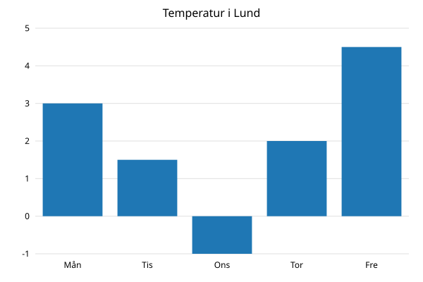
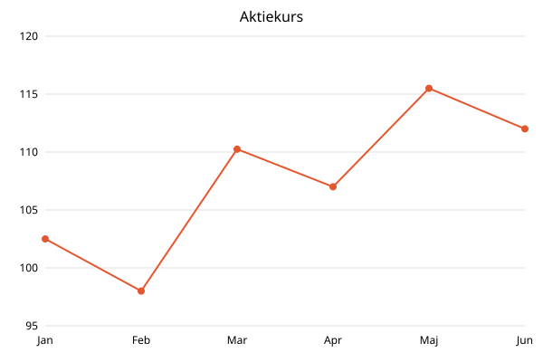

# svg-charts

A small Java library that turns a list of numbers into a bar chart or line chart, returned as an
SVG string. It has no dependencies, and the axes get readable steps automatically (0, 5, 10, 15
instead of 0, 4.5, 9, 13.5).

<p>
  
  
</p>

```java
BarChart chart = new BarChart();
chart.setTitle("Temperatur i Lund");
chart.setLabels(List.of("Mån", "Tis", "Ons", "Tor", "Fre"));
chart.setValues(List.of(3.0, 1.5, -1.0, 2.0, 4.5));

String svg = chart.toSvg();
```

## What it does

- Draws **bar charts** and **line charts** from one series of numbers.
- Chooses **readable axis steps** automatically: steps are always 1, 2 or 5 times a power of ten.
- Handles **negative values** (bars grow downwards from zero) and edge cases such as all values
  being equal, a single value or very small decimals.
- Returns a **plain SVG string** that you can put straight into an HTML page, save as a `.svg` file
  or send from a web server.
- **Escapes text** in titles and labels, so characters like `<`, `&` and `"` cannot break the SVG.
- Writes numbers with a **decimal dot on every computer**, also when the default language uses a
  decimal comma (for example Swedish).
- Adds an **accessible title** (`<title>` and `role="img"`) that screen readers read aloud.
- Fails early with a **clear error message** when the input is invalid.

## What it does not do

- Several series in one chart, legends, stacked bars or pie charts.
- Interactivity, animations or tooltips.
- Rendering to PNG or other image formats.
- Reading data from files, CSV or databases.
- Shortening long labels or long numbers. See [Known limitations](#known-limitations).

## Requirements

- **JDK 25** or later.
- No other dependencies.

## Installation

### With Gradle via JitPack

Add the JitPack repository to `settings.gradle`:

```groovy
dependencyResolutionManagement {
    repositories {
        mavenCentral()
        maven { url 'https://jitpack.io' }
    }
}
```

Add the dependency to `build.gradle`:

```groovy
dependencies {
    implementation 'com.github.Robert060615:svg-charts-module:v1.0.1'
}
```

### With Maven via JitPack

```xml
<repositories>
  <repository>
    <id>jitpack.io</id>
    <url>https://jitpack.io</url>
  </repository>
</repositories>

<dependency>
  <groupId>com.github.Robert060615</groupId>
  <artifactId>svg-charts-module</artifactId>
  <version>v1.0.1</version>
</dependency>
```

### As a jar file

```bash
git clone https://github.com/Robert060615/svg-charts-module.git
cd svg-charts-module
./gradlew :lib:jar
```

The jar ends up in `lib/build/libs/`. Add it to your project's classpath.

## Usage

Everything you need is in the package `se.lnu.rm222xi.svgcharts`:

```java
import java.util.List;
import se.lnu.rm222xi.svgcharts.BarChart;
import se.lnu.rm222xi.svgcharts.ChartOptions;
import se.lnu.rm222xi.svgcharts.LineChart;
```

### Bar chart

```java
BarChart chart = new BarChart();
chart.setTitle("Temperatur i Kiruna");
chart.setLabels(List.of("Mån", "Tis", "Ons", "Tor", "Fre"));
chart.setValues(List.of(4.0, -3.0, -8.5, 2.0, -1.0));

String svg = chart.toSvg();
```

The y-axis of a bar chart always includes zero, since bars grow from the zero line.

### Line chart

```java
LineChart chart = new LineChart();
chart.setTitle("Aktiekurs");
chart.setLabels(List.of("Jan", "Feb", "Mar", "Apr", "Maj", "Jun"));
chart.setValues(List.of(102.5, 98.0, 110.25, 107.0, 115.5, 112.0));

String svg = chart.toSvg();
```

The y-axis of a line chart follows the smallest and largest value, so it does not have to start at
zero.

### Size and color

```java
ChartOptions options = new ChartOptions();
options.setWidth(800);
options.setHeight(300);
options.setColor("#e4572e");

LineChart chart = new LineChart(options);
```

### Using the result

Save it as a file:

```java
Files.writeString(Path.of("chart.svg"), chart.toSvg());
```

Or put it inside an HTML page:

```java
String html = "<html><body>" + chart.toSvg() + "</body></html>";
```

### Handling errors

Invalid input throws `ChartDataException`, which is an `IllegalArgumentException`. The message
tells exactly what is wrong:

```java
try {
  chart.setLabels(List.of("Mån", "Tis", "Ons"));
  chart.setValues(List.of(14.0, 16.0));
  chart.toSvg();
} catch (ChartDataException e) {
  System.out.println(e.getMessage()); // Expected 3 values to match labels, got 2
}
```

## API reference

### `BarChart` and `LineChart`

Both extend the abstract class `Chart` and have the same methods.

| Method | Description |
|---|---|
| `new BarChart()` / `new LineChart()` | Creates a chart with the default options. |
| `new BarChart(ChartOptions options)` / `new LineChart(ChartOptions options)` | Creates a chart with your own size and color. |
| `void setTitle(String title)` | Heading shown at the top and read aloud by screen readers. Optional. |
| `void setLabels(List<String> labels)` | One label per value, shown under the x-axis. Optional. |
| `void setValues(List<Double> values)` | The numbers to draw, from left to right. Required. |
| `String toSvg()` | Returns the chart as SVG. Does not change the chart, so you can call it several times. |

The chart keeps its own copy of the lists, so changing your list afterwards does not change the
chart.

### `ChartOptions`

| Method | Default | Allowed values |
|---|---|---|
| `void setWidth(int width)` | `600` | at least `100` |
| `void setHeight(int height)` | `400` | at least `100` |
| `void setColor(String color)` | `"#1f77b4"` (blue) | hex color with 3 or 6 digits, for example `"#f00"` or `"#ff0000"` |

### `ChartDataException`

Thrown at once by the method that received the invalid value:

| Thrown by | When | Example message |
|---|---|---|
| `setWidth`, `setHeight` | Less than 100 | `Width must be at least 100 pixels, got 99` |
| `setColor` | Not a hex color | `Color must be a hex color like "#f00" or "#1f77b4", got "red"` |
| `setTitle` | `null` | `Title must not be null` |
| `setLabels`, `setValues` | The list is `null` | `Values must not be null` |
| `setLabels`, `setValues` | An item is `null` | `Value at index 2 is null` |
| `setValues` | Infinity or NaN | `Value at index 1 must be a finite number, got Infinity` |
| `toSvg` | No values set | `Cannot render chart without values. Call setValues() first.` |
| `toSvg` | Labels set, but not one per value | `Expected 5 values to match labels, got 4` |

## Known limitations

- Long labels are not shortened and can overlap each other.
- Very long numbers on the y-axis (such as `2400000`) can be cut off at the left edge.
- At the minimum size of 100 × 100 the axis numbers overlap.

These are shown in test cases VT10, VT12 and VT13 in the [test report](TEST_REPORT.md).

## Running the tests

```bash
./gradlew check
```

This runs the unit tests with JUnit 5 and checks the code with Checkstyle and PMD. A summary is
written to `lib/build/reports/test-summary.log`.

To see the visual test cases:

```bash
./gradlew :app:run
```

Then open `app/demo.html` in a web browser. What each chart should look like is described above
it. The results are in [TEST_REPORT.md](TEST_REPORT.md).

## Project structure

| Folder | Content |
|---|---|
| `lib/` | The library itself: the code you use. |
| `app/` | A test app that draws all visual test cases. Not part of the library. |
| `docs/` | Example images for this README. |

## Contributing

Found a bug or have an idea? Open an
[issue](https://github.com/Robert060615/svg-charts-module/issues) and describe what you did, what
you expected and what happened instead. Pull requests are welcome. Please run `./gradlew check`
before you open one.

## License

Released into the public domain under [the Unlicense](LICENSE). You may use, change and share the
code however you want.
